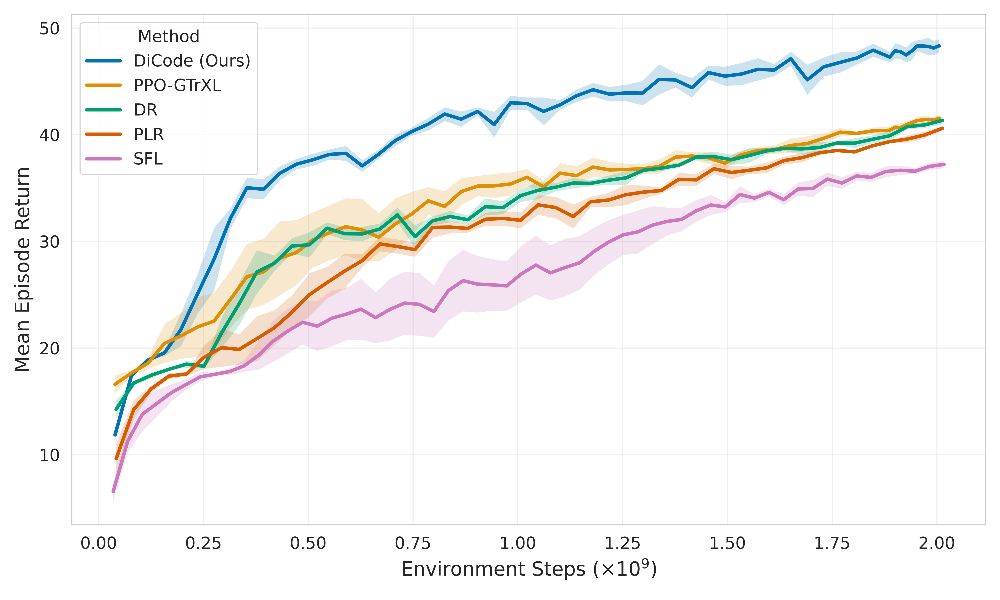

<div align="center">

# Dreaming in Code for Curriculum Learning in Open-Ended Worlds

[](https://arxiv.org/abs/2602.08194)
[](https://konstantinosmitsides.github.io/dreaming-in-code)

<br>

[](https://opensource.org/licenses/MIT)
[](https://www.python.org/downloads/)
[](https://github.com/google/jax)

<br>

*Foundation Models that "dream" and materialize executable environment code to scaffold learning in open-ended worlds.*

</div>

---

## 💡 What is this?

**Dreaming in Code (DiCode)** is an Unsupervised Enviornment Design framework that uses Foundation Models (FMs) to generate **executable Python code** for training environments (or levels). Instead of just randomizing parameters, DiCode writes the logic itself – creating a curriculum of distinct levels that bridge the gap between an agent's current skills and the complexities of open-ended worlds.

<div align="center">
<br/>

<br/>
</div>

The framework operates in a closed feedback loop:
1.  **Dream:** An FM synthesizes new environment code (transition dynamics, initial states, goals) tailored to the agent's current capabilities.
2.  **Evaluate:** The agent is trained on these generated levels; performance data flows back into the archive.
3.  **Refine:** High-learning-signal levels become "parents" for the next generation of code, creating an infinite, self-correcting curriculum.

---

## 📈 Key Results

<div align="center">

</div>

> **SOTA Performance on [Craftax](https://github.com/MichaelTMatthews/Craftax):** DiCode dominates throughout training, achieving a **16% improvement** in mean return over the strongest baseline (PPO-GTrXL).

By structuring the curriculum through code generation, DiCode:
* **Solves the "Impossible":** Achieves non-zero success on late-game tasks (e.g., *Defeat Gnome Warrior*, *Defeat Gnome Archer*) where baselines fail completely (**0% success**).
* **Unlocks Exploration:** Scaffolds instrumental milestones (e.g., *Make Iron Armour*), enabling the agent to survive long enough to reach and master deep exploration targets.

### 🎥 Watch Gameplay Comparison

| RL Baseline (PPO-GTrXL) on Craftax | DiCode Agent (Ours) on Craftax |
| :---: | :---: |
|  |  |
| *Struggles with initial survival.* | *Reaches late-game content.* |

---

## 🚀 Quick Start

Get running in seconds using [uv](https://github.com/astral-sh/uv).

```bash
# 1. Clone & Install
git clone https://github.com/konstantinosmitsides/dreaming-in-code.git
cd dreaming-in-code
uv sync --all-extras

# 2. Install JAX (Ensure [cuda12] matches your driver)
uv pip install "jax[cuda12]"

# 3. Configure Secrets
cp .env.example .env
# Edit .env to add your API keys

# 4. Train Agent
uv run experiments/training/run_dicode.py
```

## ⚙️ Advanced Setup

<details>
<summary><b>Apptainer & Docker Support</b></summary>

**Apptainer (Singularity)**
```bash
# Build
apptainer build dicode.sif apptainer/container.def

# Run training
apptainer run --nv dicode.sif

# Interactive shell
apptainer shell --nv --bind .:/workspace dicode.sif
```
**Docker**
```bash
# Build
docker build -t dicode .

# Run training
docker run --gpus all --env-file .env dicode

# Interactive shell (Development)
docker run --gpus all -it --env-file .env -v $(pwd):/workspace dicode /bin/bash

```

</details>

<details>
<summary><b>Pip / Standard Install</b></summary>

If you prefer not to use [uv](https://github.com/astral-sh/uv), you can install via pip:

```bash
# 1. Install package and dependencies
pip install -e .[dev,evaluation]

# 2. Install JAX (Ensure [cuda12] matches your driver)
pip install "jax[cuda12]"
```

</details>

<details>
<summary><b>Configuration & Hydra Overrides</b></summary>

DiCode uses [Hydra](https://hydra.cc/) for configuration. You can override any parameter from the command line:

```bash
# Make seed random, disable WandB
uv run experiments/training/run_dicode.py seed=$RANDOM use_wandb=false

```

</details>

---

## 📜 Citation

```bibtex
@misc{mitsides2026dreamingcodecurriculumlearning,
      title={Dreaming in Code for Curriculum Learning in Open-Ended Worlds}, 
      author={Konstantinos Mitsides and Maxence Faldor and Antoine Cully},
      year={2026},
      eprint={2602.08194},
      archivePrefix={arXiv},
      primaryClass={cs.LG},
      url={https://arxiv.org/abs/2602.08194}, 
}
```